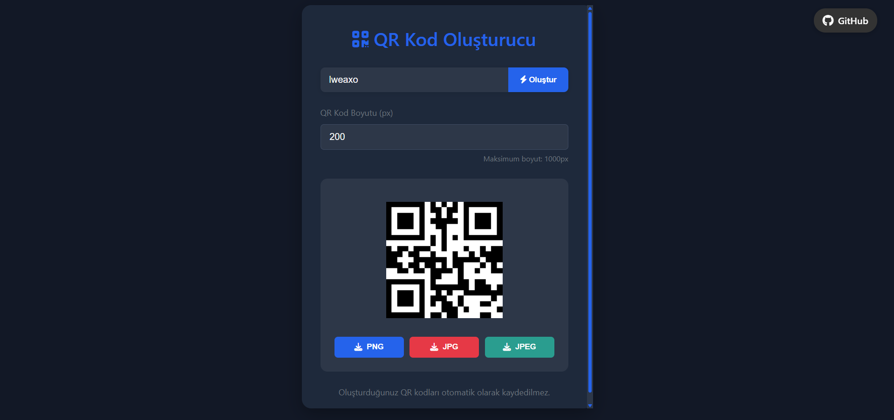
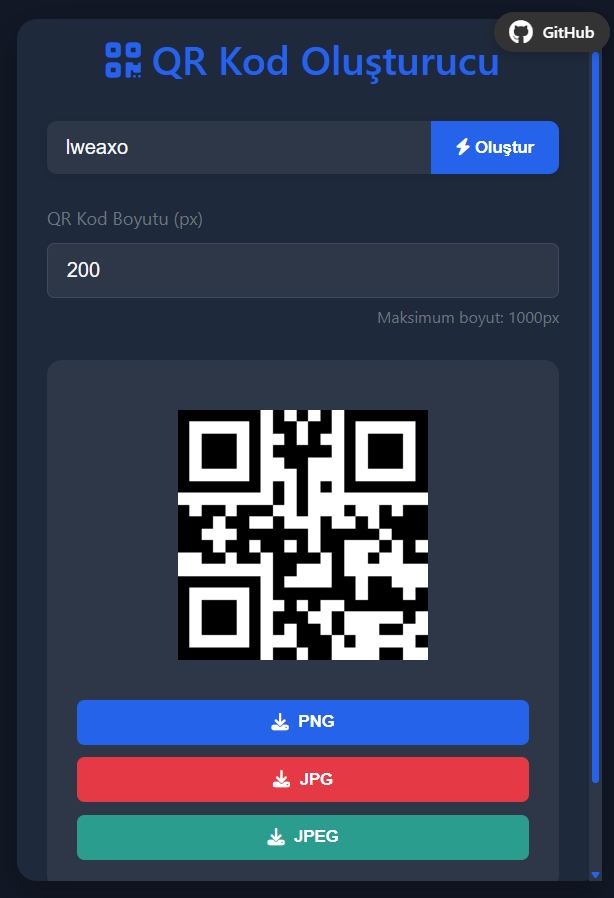

# 💎 QR Kod Oluşturucu



## 📌 Özellikler

- **Kullanıcı Dostu Arayüz**: Modern ve temiz tasarım
- **Çoklu Format Desteği**: PNG, JPG, JPEG formatlarında indirme
- **Özelleştirilebilir Boyut**: 50px - 1000px arası boyut seçeneği
- **Gerçek Zamanlı Önizleme**: Anında QR kodu oluşturma
- **Karanlık Mod**: Göz yormayan karanlık tema
- **Responsive Tasarım**: Tüm cihazlarda mükemmel görüntüleme

## 🚀 Kullanım

1. Metin veya URL girin
2. Boyut ayarlayın (isteğe bağlı)
3. "Oluştur" butonuna basın
4. İstediğiniz formatta indirin

## 🛠️ Teknolojiler

- HTML5
- CSS3 (Flexbox, Grid, Variables)
- JavaScript (ES6+)
- [QRCode.js](https://davidshimjs.github.io/qrcodejs/) Kütüphanesi
- Font Awesome ikonları

## 📦 Kurulum

```bash
git clone https://github.com/LWEAXO/qr-code-generator.git
cd qr-code-generator
# index.html dosyasını tarayıcıda açın
```

## 📜 Lisans
MIT Lisansı - [Detaylar için LICENSE dosyasına bakın](LICENSE)

## 🌍 Canlı Demo
[](https://qr-code-generatorrr-lweaxo.vercel.app/)

## 📸 Ekran Görüntüleri

| Desktop | Mobile |
|---------|--------|
|  |  |

## 💡 Katkıda Bulunma

1. Forklayın
2. Yeni branch oluşturun (`git checkout -b feature/fooBar`)
3. Değişikliklerinizi commit edin (`git commit -am 'Add some fooBar'`)
4. Push yapın (`git push origin feature/fooBar`)
5. Pull Request oluşturun

## 📞 İletişim

[](https://discord.com/users/1015356240492245054)
[](https://instagram.com/lweaxo)
---
